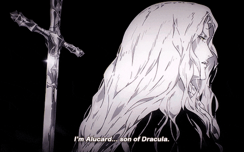

# Alucard Theme for VS Code

<div align="center">



A sophisticated VS Code theme inspired by Castlevania's aesthetic, featuring both dark and light variants.

[](https://marketplace.visualstudio.com/items?itemName=Edmo.alucard-nocturne)
[](https://marketplace.visualstudio.com/items?itemName=Edmo.alucard-nocturne)
[](https://marketplace.visualstudio.com/items?itemName=Edmo.alucard-nocturne)

</div>
<p align="center">
<sub><samp>&nbsp;&nbsp;&nbsp;&nbsp;&nbsp;&nbsp;&nbsp;Font | <a href="https://input.djr.com/">Input Mono</a><br>
&nbsp;File Icons | <a href="https://marketplace.visualstudio.com/items?itemName=Catppuccin.catppuccin-vsc-icons">Catppuccin</a><br>
Product Icons | <a href="https://github.com/antfu/vscode-icons-carbon">Carbon</a>&nbsp;&nbsp;&nbsp;&nbsp;&nbsp;&nbsp;<br></sub>
</p>

## 🧛‍♂️ Installation

1. Open VS Code
2. Go to Extensions (Ctrl+Shift+X / Cmd+Shift+X)
3. Search for "Alucard Nocturne"
4. Click Install
5. Press Ctrl+K Ctrl+T / Cmd+K Cmd+T to open the theme selector
6. Select either "Alucard Nocturne Theme (Dark)" or "Alucard Nocturne Theme (Light)"

## Match with System

```jsonc
// .vscode/setting.json
{
  "window.autoDetectColorScheme": true,
  "workbench.preferredLightColorTheme": "Alucard Nocturne Theme (Light)",
  "workbench.preferredDarkColorTheme": "Alucard Nocturne Theme (Dark)",
}
```

## 🎨 Color Palette

### Dark Theme


### Light Theme

## 📸 Screenshots

### Dark Theme


### Light Theme


## ✨ Features

- Two carefully crafted theme variants (Dark and Light)
- Thoughtful color selections for optimal readability
- Semantic highlighting support
- Custom UI elements theming
- Consistent color palette across all elements
- Carefully selected contrasts for accessibility

## 🤝 Contributing

1. Fork this repository
2. Create a new branch for your changes
3. Make your changes
4. Submit a pull request

## 👥 Team

This theme is maintained by:

| [](https://github.com/edmolima) |
| ------------------------------------------------------------------------------------- |
| [Edmo Lima](https://github.com/edmolima)                                              |

## 📝 Changelog

The changelog is available on the release page in each theme's repository.

## 📄 License

[MIT License](./LICENSE) © Alucard Nocturne Theme

---

<div align="center">

**🧛‍♂️ Happy Coding! 🦇**

[Report an Issue](https://github.com/edmolima/alucard/issues) · [Request a Feature](https://github.com/edmolima/alucard/issues)

</div>